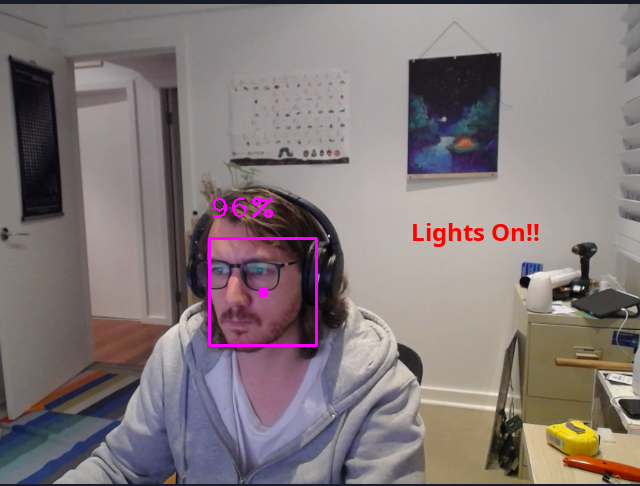
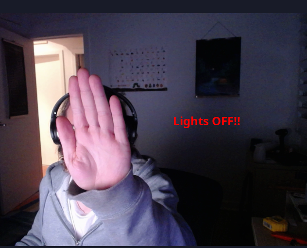

# Face Detect MQTT
Face or Pose detector that emits MQTT events when a face or human body is detected and not detected.

I built this as an alternative to using PIR motion sensors to turn on the lights in my office.
I found that when sitting at my computer (somewhat motionless), the PIR motion sensors stop detecting
motion and turn off the lights while I am still in the room.

Instead of using motion sensors, this project is constantly monitoring a camera (attached to a raspberry pi)
and looking to see if a face is present on the camera - if a face is present, the lights stay on.

My raspberry pi + camera are placed on my desk under my computer monitors. When I walk into the room and sit
down at my computer my face is detected - and continue to be detected while I sit at the computer.





## Detection Modes
Use the `DETECTION_METHOD` environment variable to set which detection mode (`face` or `pose`).

Face only detects your face.

Pose detects full body poses (and seems to work fine when your body is obstructed behind a desk).


## MQTT Events
Note: the mqtt client id is customisable via environment variables. The default `cvzone_tracker_01` is used in the examples below
### Face/Pose Detected
A face or pose has been detected
```
MQTT Topic: home/cvzone_tracker_01/detected
Payload: 1
```

### Face/Pose Not Detected
A face or pose is no longer detected (a face or pose must be detected first)
```
MQTT Topic: home/cvzone_tracker_01/detected
Payload: 0
```

### Face Detection Score
The current score of the detected face. Useful for tweaking your `MIN_FACE_SCORE` value

Note you must enable the `PUBLISH_SCORE` setting in your docker config
```
MQTT Topic: home/cvzone_tracker_01/score
Payload: number between 0.0 and 1. E.g. 0.5
```

### Connected
MQTT client has connected
```
MQTT Topic: home/cvzone_tracker_01/status
Payload: connected
```

### Disconnected
MQTT client has disconnected (sent as MQTT last will message)
```
MQTT Topic: home/cvzone_tracker_01/status
Payload: disconnected
```

## Raspberry Pi Pre-requisites (using the RPi Camera Module)
*Required*: Raspberry Pi OS 64-bit

Set the following options in `raspi-config` and reboot:
 - GPU Memory -> 256
 - Legacy Camera Stack -> Enabled

Install docker:
```
curl -fsSL https://get.docker.com -o get-docker.sh
sudo sh get-docker.sh
sudo usermod -aG docker pi
sudo systemctl enable docker
sudo reboot
```

## Run with docker
```
docker run \
  -d \
  --restart=unless-stopped \
  --device /dev/video0 \
  -e MQTT_ADDRESS="10.1.1.100" \
  -e MQTT_PORT="1883" \
  -e MQTT_CLIENT_ID="cvzone_tracker_01" \
  -e DETECTION_METHOD="face" \
  -e MIN_FACE_SCORE="0.5" \
  -e ROTATE_IMAGE="0" \
  -e PUBLISH_SCORE="0" \
  --name=face-detect-mqtt \ 
  selexin/face-detect-mqtt:latest
```

### Environment Variables
 - `MQTT_ADDRESS` - IP Address of MQTT broker on local network
 - `MQTT_PORT` - Port of MQTT broker on local network
 - `MQTT_CLIENT_ID` - Custom MQTT client ID to use
 - `DETECTION_METHOD` - Either `face` or `pose`. Face only detects faces. Pose detects full body poses. 
 - `MIN_FACE_SCORE` - Number between `0.0` and `1.0`. Ignore face detections with a confidence lower than this number (only used when `DETECTION_METHOD` = `face`). 
 - `ROTATE_IMAGE` - Set to "1" to if your camera is upside-down
 - `PUBLISH_SCORE` - Set to "1" to if you want to continuously publish the current face detect score


## Manually install and run
```
sudo apt update
sudo apt install pyhton3 python3-opencv
sudo pip3 install -r requirements.txt

python3 src/main.py
```

## License
MIT - see [LICENSE.md](https://github.com/se1exin/face-detect-mqtt/blob/master/LICENSE.md)
